# ServiceAware

The project is a monitoring service. It can monitor the changes of service status in real time. 

Besides, it can send emails or SMS to notify the changes of a specific service.

The system can monitor services in real time by using websocket.

## Build

Build in the normal way on Mac:
1. make sure ipe is running
  
    ```
    cd ipe
    ./ipe
    ```

2. create database using postgreSQL, which name is vigilate. 

    ```
    // create tables.
    soda migrate 
    // insert a user into the table users, and use it to sign in
    ```
    
3. run the service

    ```
    cd ServiceAware
      ./run.sh
    ```
  
4. visit localhost:4000

## Screenshot

1. The overview page shows the count of services in different status, and all the hosts.

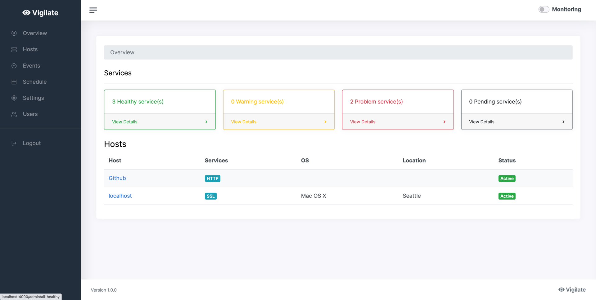

2. The Login and Logout page

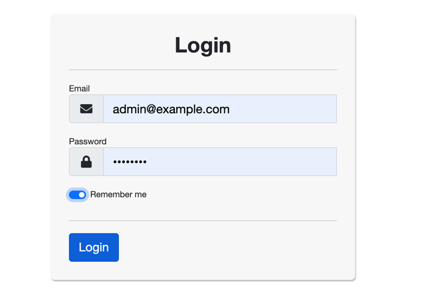

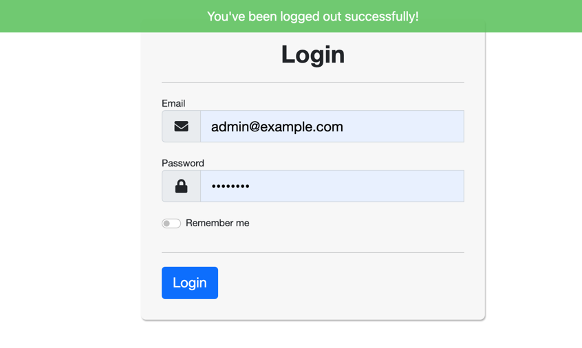

3. Adding the host which you want to monitor

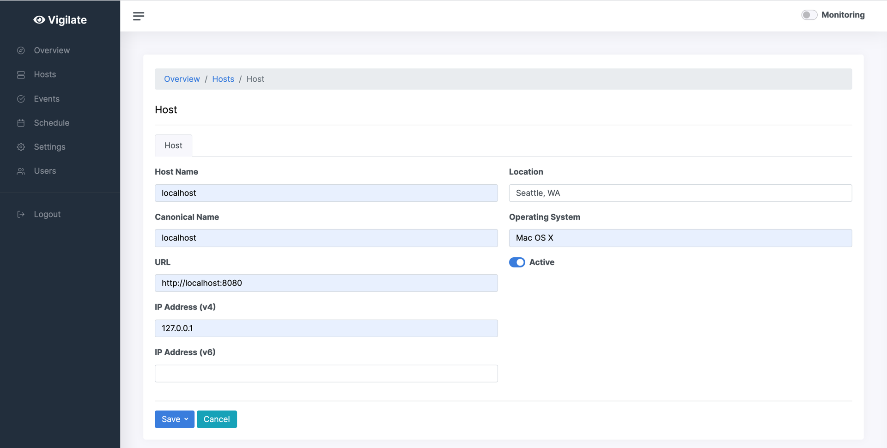

4. Monitoring the specific services on the host.

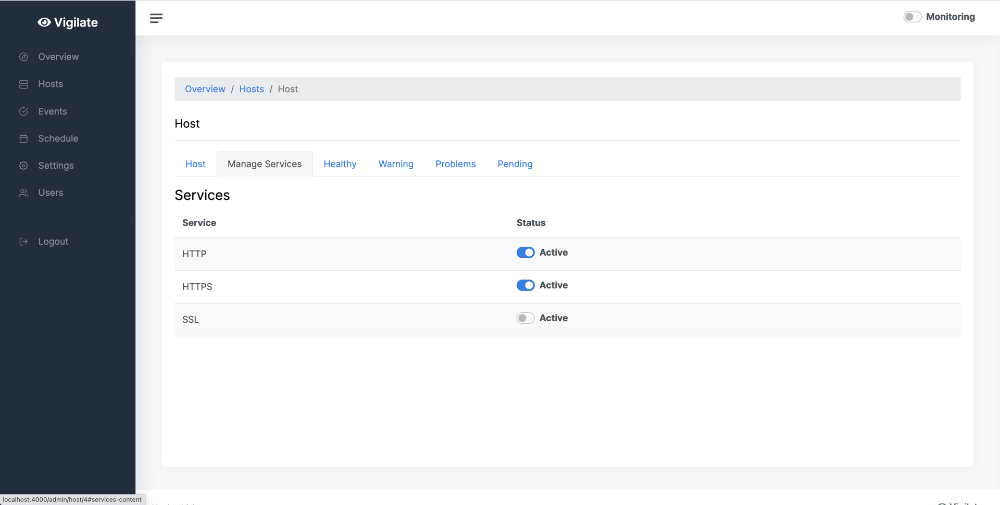

5. The event page shows the changes of service status.

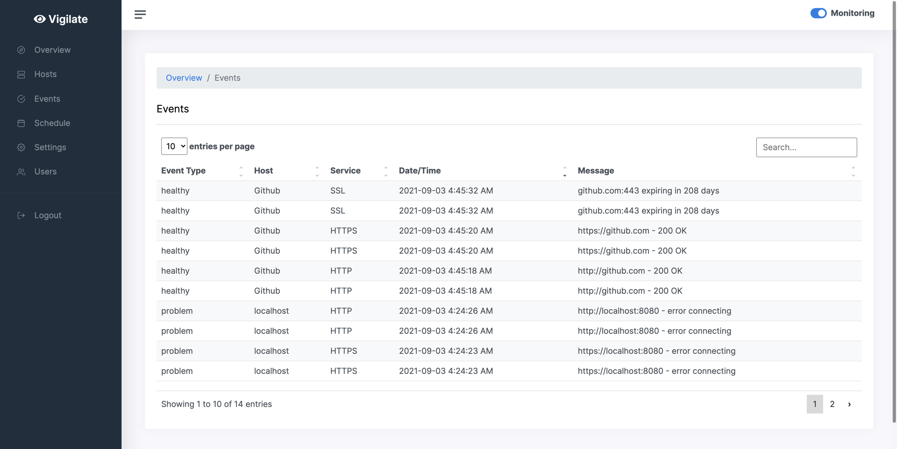

6. The schedule page displays all the services we are monitoring when the monitoring button opens.

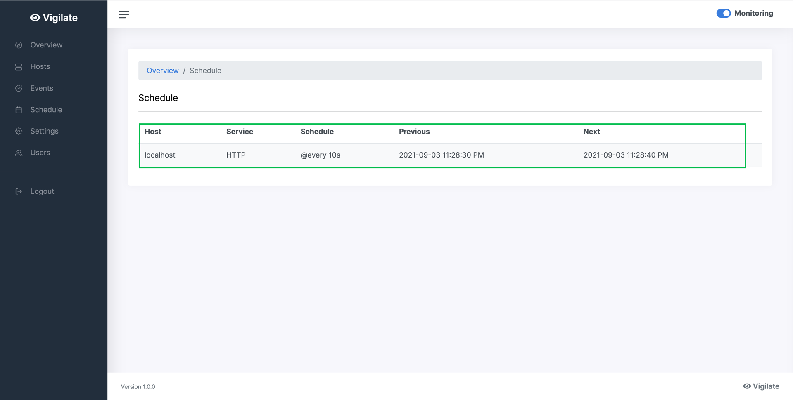

7. The settings page allows us to get notifications about the changes of service status through email or SMS.

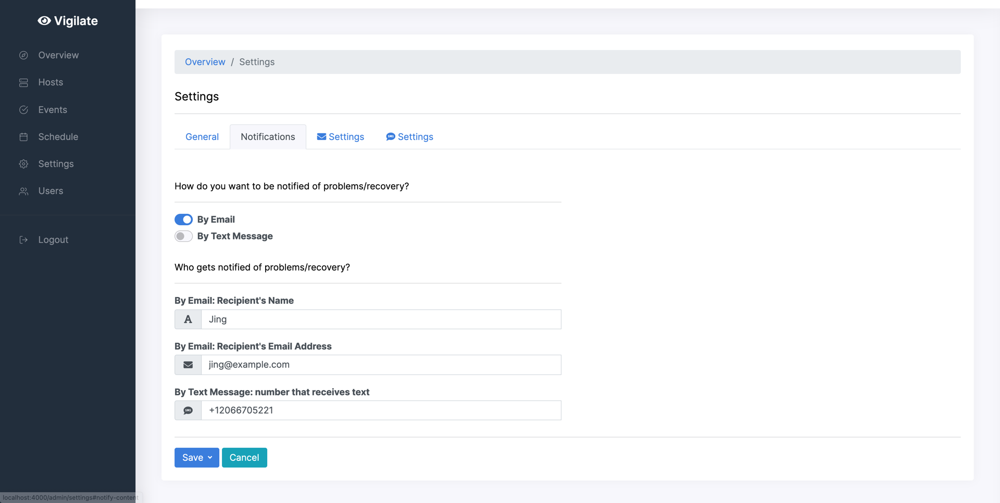

   Email notifications (mailhog):

   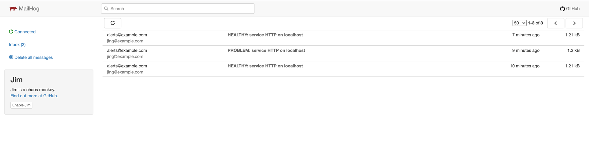

   SMS notifications (twilio):

   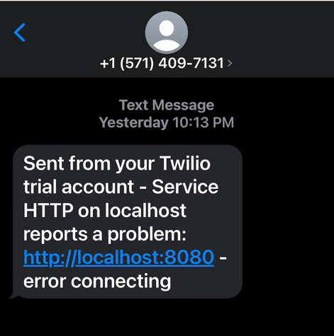

8. The users page show all the users.

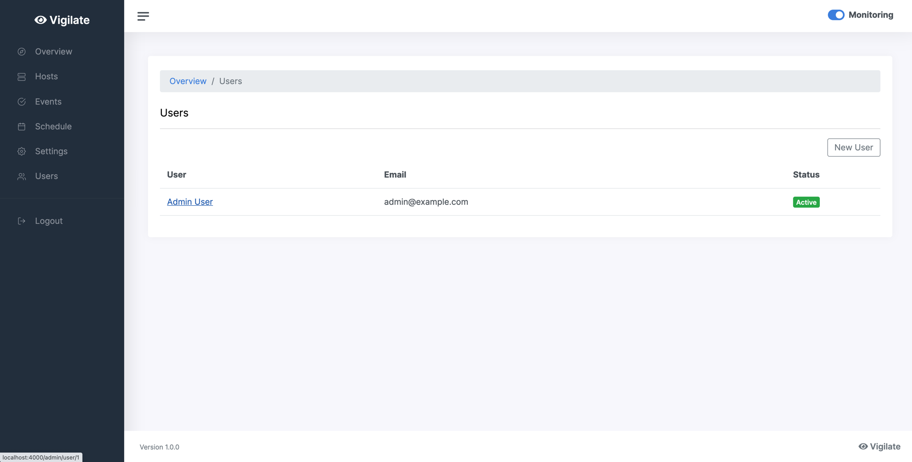


## Real-time Monitoring System: 

There are four status of services, including healthy, warning, problem, and pending. When monitoring, the changes of status will be displayed **automatically**.

eg. The Host Page: /admin/host/hostID

Before we open the service on port 8080, these two services are in the problem status:

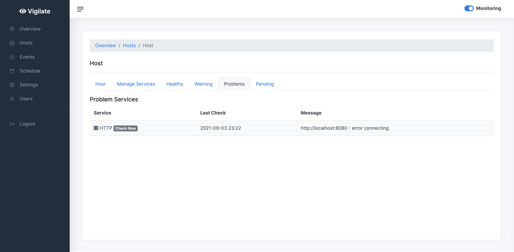

After we open this service, their status changes to be in healthy status:

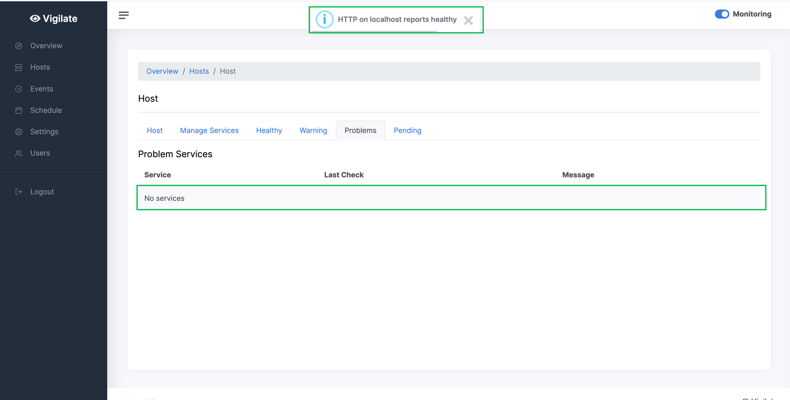

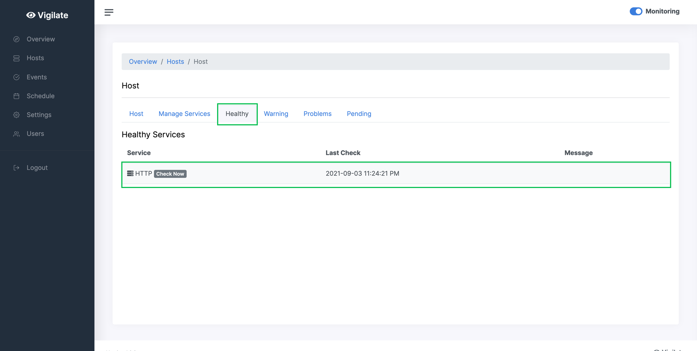
     
   
Besides, All the pages are in real time, including the counts of services with different status on overview page, events and schedule.
   
   